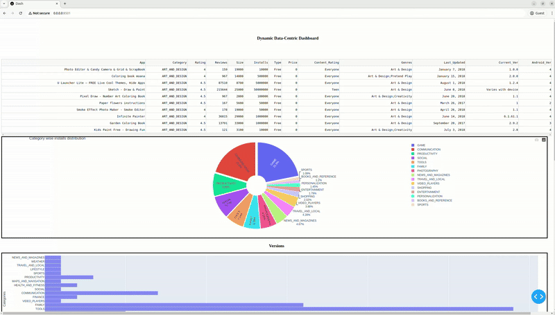

# Dynamic Data-Centric Dashboard for Playstore Analysis


This project showcases advanced data visualisation skills using Dash, Plotly, and Pandas. The application features an interactive dashboard that provides insightful analyses of a Playstore dataset found in the `data\` directory.

## Overview

The dashboard presents a comprehensive view of the dataset through various visualisations, including:

- **Data Table:** Displays a preview of the dataset.
- **Pie Charts:** Visualises category-wise installation distributions.
- **Version Analysis:** Utilises a slider-controlled histogram to depict the distribution of apps across different Android versions.
- **Category Analyzer:** Presents dynamic histograms for rating trends and installation counts within a selected category.
- **Correlation Analysis:** Offers a scatter plot to explore correlations between different dataset attributes.

The project includes a custom preprocessing module (`data_preprocess.py`) that cleans and transforms the data, ensuring accurate and reliable visual outputs.

## Project Structure

```
.
├── dash_app.py               # Main application file that builds and serves the dashboard
├── data_preprocess.py   # Module for data cleaning and preprocessing
├── data
│   └── playstore-analysis.csv  # Dataset file for analysis
└── README.md            # This documentation file
```

## Features

- **Interactive Dashboard:** Built using Dash, the dashboard layout is responsive and user-friendly.
- **Dynamic Visualisations:** User inputs such as dropdowns and sliders trigger updates to the visualisations, enabling real-time data exploration.
- **Robust Data Preprocessing:** The `data_preprocess.py` module ensures the dataset is clean by handling missing values, correcting data types, and filtering out unwanted records.
- **Multiple Plot Types:** Utilises various Plotly graph types including pie charts, histograms, and scatter plots to provide diverse insights into the dataset.

## Installation

Ensure you have Python 3.x installed along with the following libraries:

- `pandas`
- `plotly`
- `dash`

You can install the required packages using pip:

```bash
pip install pandas plotly dash
```

## Setup & Usage

1. **Clone the Repository:**

   ```bash
   git clone https://github.com/exponentialR/DataVisPortfolio.git
   cd DataVisPortfolio
   ```

2. **Dataset Placement:**

   Place your Playstore dataset (`playstore-analysis.csv`) inside the `data\` directory.

3. **Run the Application:**

   Execute the following command in your terminal:

   ```bash
   python dash_app.py
   ```

4. **Access the Dashboard:**

   Open your web browser and navigate to:  
   `http://0.0.0.0:8501`

## Code Overview

### Data Loading & Preprocessing

- The dataset is loaded using Pandas:
  
  ```python
  dataset_frame = pd.read_csv('data/playstore-analysis.csv')
  ```

- Data cleaning is performed in `data_preprocess.py`:
  - **Android Version Processing:** Regular expressions are used to extract the primary version number.
  - **Missing Rating Imputation:** Missing ratings are replaced by the average rating of the respective category.
  - **Data Type Conversions:** Converts fields such as `Rating`, `Reviews`, `Installs`, and `Price` to numerical types.
  - **Record Filtering:** Removes records with "Unrated" content and drops any remaining NaN values.

### Dashboard Components

- **Data Table:** Uses `dash_table.DataTable` to display the first few rows of the dataset.
- **Pie Charts:** Two variations (a simple pie chart and a donut chart) display the installation distribution across categories.
- **Version Analysis:** A histogram updated via a slider shows the number of apps per category for a selected Android version.
- **Category Analyzer:** Features dynamic histograms for rating trends and installation counts based on a selected category.
- **Correlation Analysis:** A scatter plot visualises the relationship between any two selected dataset variables.

### Interactivity

- **Dash Callbacks:** The dashboard employs several callbacks to ensure dynamic updates:
  - **Version Histogram:** Updated when the user moves the slider.
  - **Category Visualisations:** Updated when the user selects a category from a dropdown.
  - **Correlation Scatter Plot:** Updated when the user selects different variables for the x-axis and y-axis.

## Future Enhancements

- [ ] **User Experience Improvements:** Further refine the dashboard's interactivity and layout.
- [ ] **Advanced Analytics:** Integrate more sophisticated visualisations and statistical analyses.
- [ ] **Performance Optimisation:** Enhance the application’s scalability to efficiently handle larger datasets.


This project is a practical demonstration of modern data visualisation practices using Dash and Plotly. By combining robust data preprocessing with interactive dashboard elements, it provides a platform for comprehensive exploration and analysis of Playstore data.

If you have any questions or suggestions, please feel free to get in touch.

Cheers!
